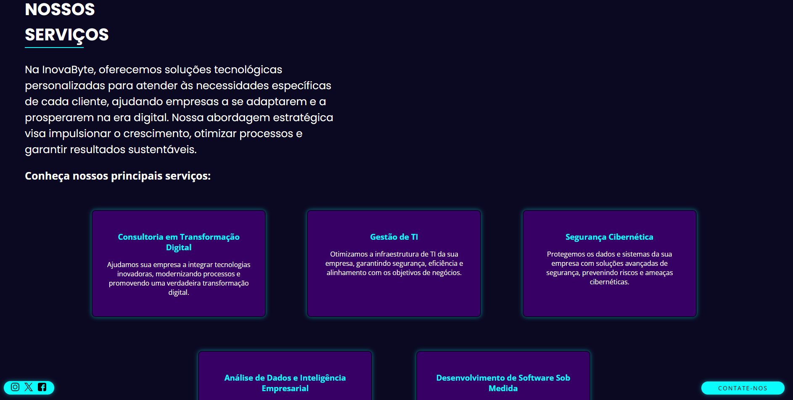
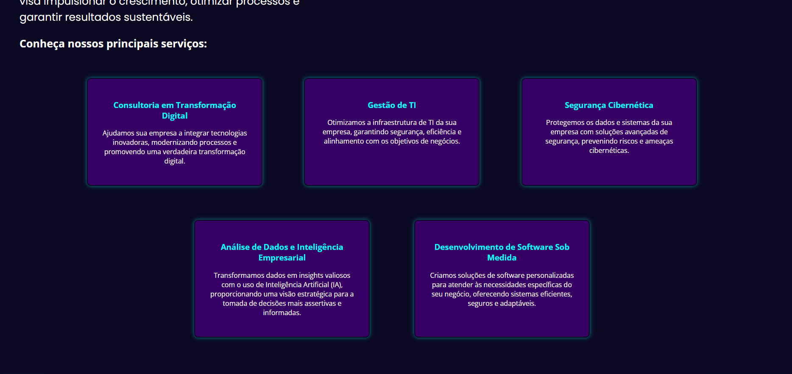
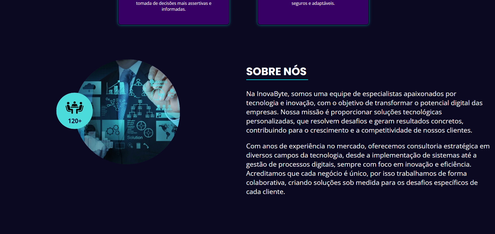
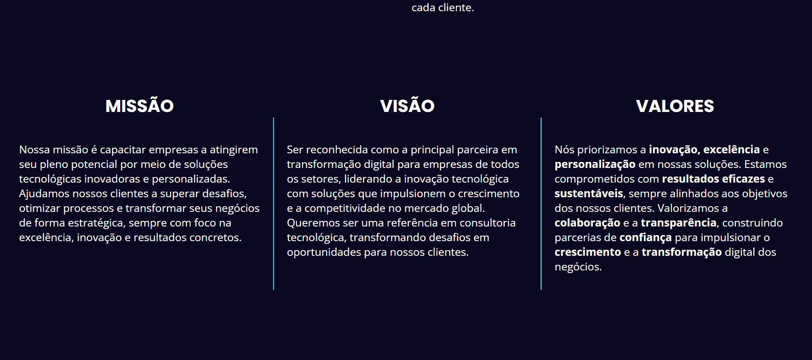
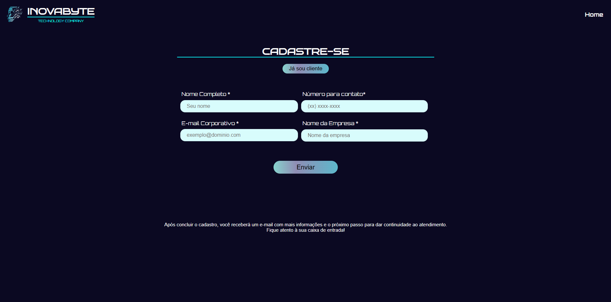

# INOVABYTE CONSULTORIA🏢

A Inovabyte foi criada para auxiliar empresas de diversos segmentos na adoção de soluções tecnológicas inovadoras. 


<p align="center">
  
</p>

## 🧥 SERVIÇOS

Seus serviços incluem cloud computing, inteligência artificial, análise de dados e cibersegurança, impulsionando a transformação digital e garantindo maior eficiência operacional. Com a aplicação dessas soluções, as empresas se tornam mais competitivas e preparadas para os desafios do mercado.


## 🚀 Processos para a construção

- Prototipagem - Canva
- Documentação - word e excel
- Codigos HTML e CSS
- Melhorias com Javascript


## 📖 Aprendizados

Durante o processo, conseguimos compreender melhor como cada uma dessas ferramentas e tecnologias contribui para a criação e manutenção de um site dinâmico e funcional.

- HTML (HyperText Markup Language): Começamos com a base do nosso site, utilizando HTML para estruturar as páginas. Aprendemos como organizar o conteúdo em seções, como cabeçalhos, parágrafos, listas e links. Cada elemento teve um papel importante para dar forma ao que vemos no navegador. A semântica também foi fundamental para tornar o código mais acessível e compreensível, usando tags como header, footer, e outras.

- CSS (Cascading Style Sheets): Depois, passamos para a parte visual com o CSS. Aprendemos como estilizar as páginas, definindo cores, fontes, espaçamentos, e organizando o layout usando propriedades como display, flexbox e grid. Descobrimos o poder do CSS para criar um design atrativo e funcional, e como ele se conecta diretamente com o HTML para dar vida ao conteúdo.

- Git e GitHub: O Git foi usado principalmente para versionamento e controle de alterações no código, enquanto o GitHub serviu para armazenar o repositório do projeto. Isso nos permitiu ter uma cópia segura do nosso código na nuvem e compartilhar o repositório facilmente com outras pessoas ou equipes. Usamos o Git para criar "commits" e registrar as mudanças feitas no código, e o GitHub facilitou o armazenamento e acesso ao repositório de qualquer lugar, sem a preocupação de perder o trabalho feito.

- JavaScript: Embora o uso de JavaScript tenha sido mínimo, ele foi essencial para alguns detalhes do site. Utilizamos JavaScript em pontos específicos para adicionar pequenas funcionalidades interativas, como animações e validações simples de formulário. Apesar de não termos explorado muito a linguagem, esses pequenos toques ajudaram a tornar a experiência do usuário mais dinâmica e fluida, além de nos proporcionar uma introdução prática ao que podemos fazer com JavaScript em projetos futuros.

**Conclusão:** Ao criar o site, percebemos o quanto é importante a integração entre essas ferramentas e tecnologias. HTML e CSS formam a base, Git e GitHub garantem um bom controle de versão e colaboração, enquanto o JavaScript acrescenta interatividade e dinamicidade. Cada um desses elementos desempenha um papel essencial no desenvolvimento web, e o aprendizado prático foi fundamental para entender seu funcionamento no mundo real.

## 📌 Como Acessar o Projeto  

Atualmente, o site não está hospedado online. Para acessá-lo, siga os passos abaixo para rodá-lo localmente em sua máquina.  

### **1️⃣ Clone o Repositório**  
Abra o terminal e execute:  
```bash
git clone [https://github.com/Isabelle-maximow/InovaByte.git]
cd InovaByte
```

## 📞 Feedback
Se você tiver algum feedback, por favor nos deixe saber por meio de  isabelle.l.ferreira6@aluno.senai


## 📜 Documentação

Acesse aqui nossa documentação:
[Documentação](file:///C:/Users/24271526/Documents/Gr%C3%A1fico%20de%20Gantt%20simples.pdf)


## 👥Autores

- [@Isabelle-maximow](https://github.com/Isabelle-maximow)
- Julia Lopes
- Hadassa Honorato
- [@gustaalbuquerq](https://github.com/gustaalbuquerq)
- Caua Nogueira 

## Mais do Projeto
### Página Inicial ao entrar so site:


### Serviços:




### Sobre Nós:



### Missão Visão e Valor:


### Cadastrar-se: 

